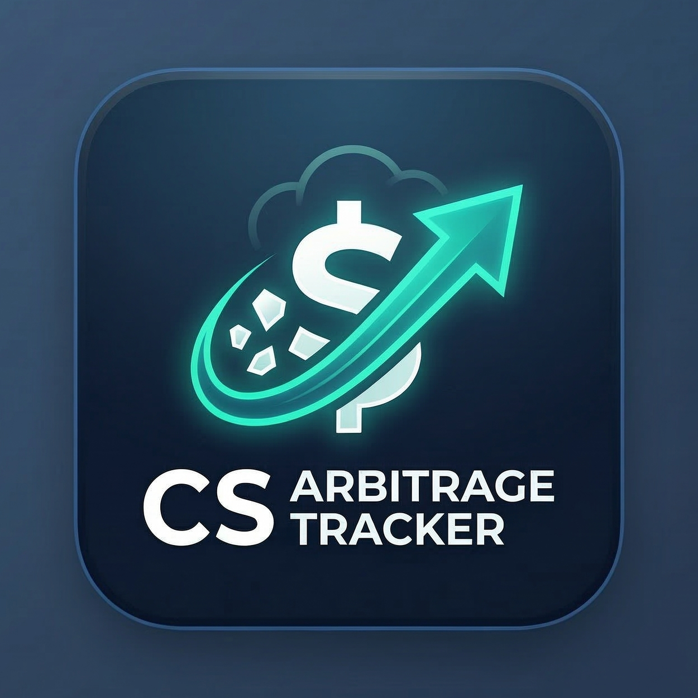

# CS Arbitrage Tracker

<p align="center">
	
</p>

<p align="center">
	Steam ve CSFloat işlemlerini hesaplamak, kaydetmek ve Firebase ile tum cihazlarda senkron takip etmek icin modern arayuz.
</p>

## Ozellikler

- Firebase Authentication ile e-posta/sifre giris ve kayit
- Firestore ile kullanici bazli veri saklama
- Cihazlar arasi senkron islem listesi
- Steam -> CSFloat ve CSFloat -> Steam hesaplama akislari
- Islem ekleme, duzenleme, silme
- Acik, koyu ve sistem temasi

## Kurulum

1. Bagimliliklari yukleyin:

```bash
npm install
```

2. Proje kokune `.env.local` dosyasi olusturun ve Firebase bilgilerinizi ekleyin:

```env
NEXT_PUBLIC_FIREBASE_API_KEY=your_api_key
NEXT_PUBLIC_FIREBASE_AUTH_DOMAIN=your_project.firebaseapp.com
NEXT_PUBLIC_FIREBASE_PROJECT_ID=your_project_id
NEXT_PUBLIC_FIREBASE_STORAGE_BUCKET=your_project.appspot.com
NEXT_PUBLIC_FIREBASE_MESSAGING_SENDER_ID=your_sender_id
NEXT_PUBLIC_FIREBASE_APP_ID=your_app_id
NEXT_PUBLIC_GA_MEASUREMENT_ID=G-N3SFG0BFJ5
```

3. Gelistirme sunucusunu baslatin:

```bash
npm run dev
```

4. Tarayicida `http://localhost:3000` adresini acin.

## Guvenlik Notlari

- Kimlik dogrulama Firebase tarafinda yapilir, sifreler proje tarafinda saklanmaz.
- Trade verileri sadece giris yapan kullanicinin uid altinda tutulur.
- Hata mesajlari istemci tarafinda normalize edilerek gereksiz bilgi sizmasi azaltilmistir.
- Uretimde Firebase App Check, e-posta dogrulama ve brute-force korumalari da aktif edilmelidir.

## Mimari

- `src/app/login/page.tsx`: Giris sayfasi
- `src/app/register/page.tsx`: Kayit sayfasi
- `src/components/AuthShell.tsx`: Login/Register ortak modern layout
- `src/components/AuthPanel.tsx`: Oturum bilgisi ve cikis paneli
- `src/components/Dashboard.tsx`: Ana panel, Firestore senkronu
- `src/lib/firebase/client.ts`: Firebase app/auth/firestore baglantisi
- `src/lib/firebase/auth.ts`: Auth servis fonksiyonlari
- `src/lib/firebase/trades.ts`: Firestore trade CRUD ve subscription
- `src/store/useAuthStore.ts`: Auth state
- `src/store/useTradeStore.ts`: Trade state
- `src/utils/calculations.ts`: Komisyon, net satis ve oran hesaplari
